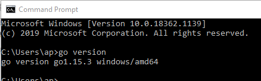
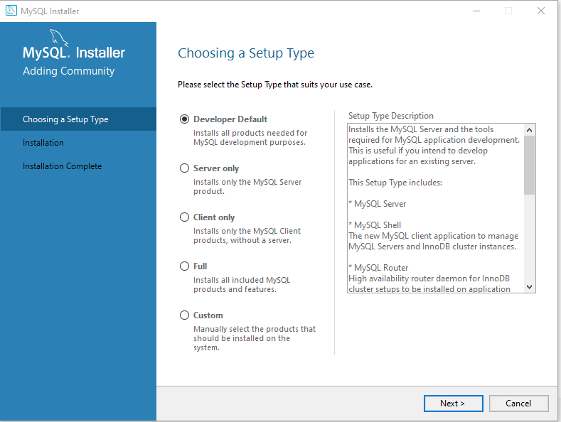
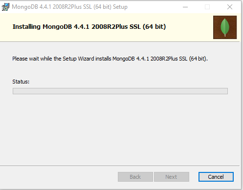
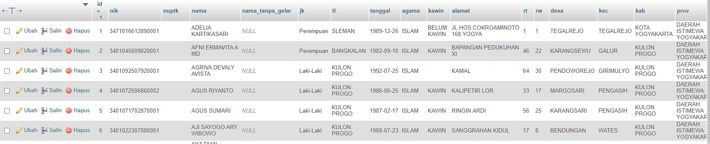
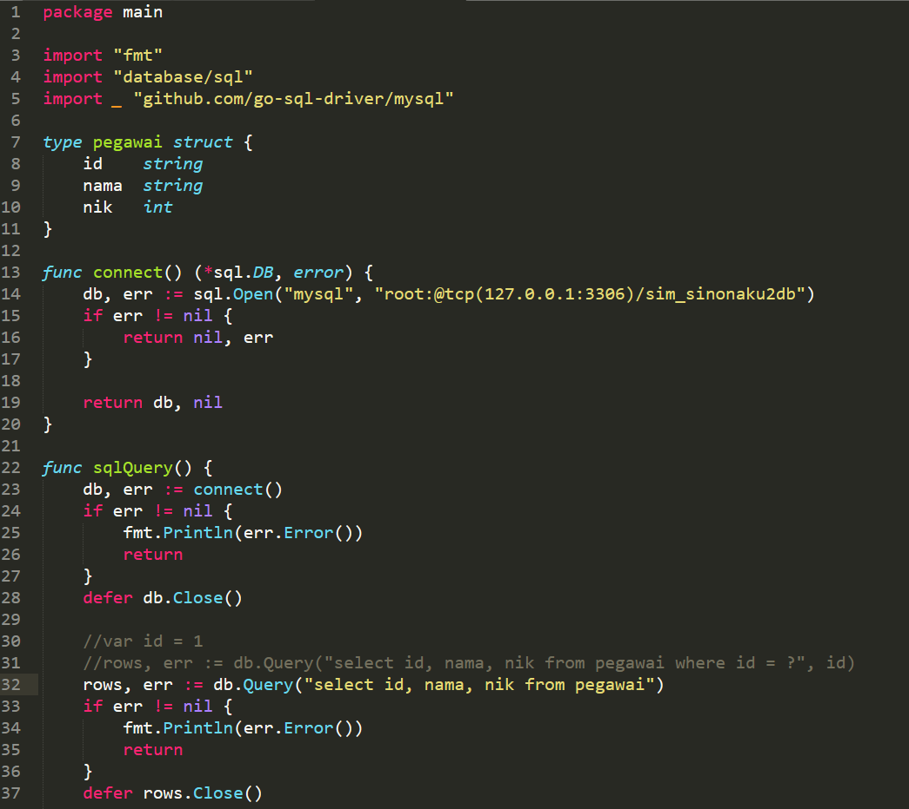
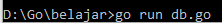
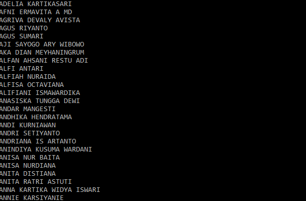
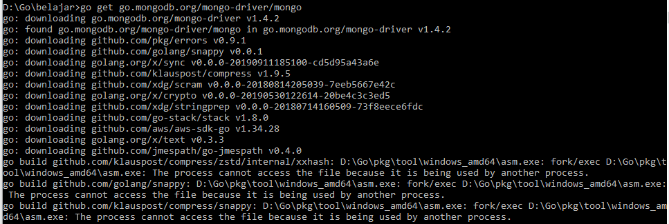
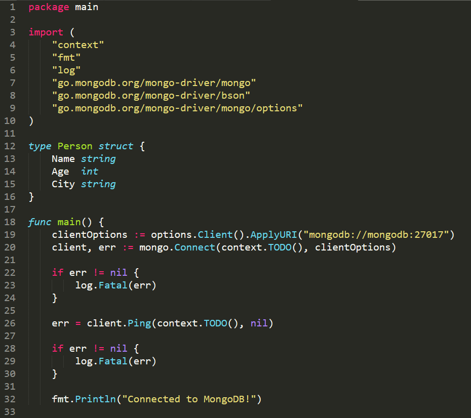
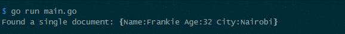

# Laporan Praktikum Teknologi Cloud Computing - Minggu 06

## Materi
**Data as A Service**

## Disusun oleh:
* Nama : Jauhari Ahmad
* No. Mhs.: 205411167

## Tujuan

1.  Mahasiswa memahami berbagai tipe software DBMS untuk mengelola berbagai model data.
2.  Mahasiswa memahami keterkaitan teknologi Cloud Computing dengan DBMS dalam konteks Data as a Service.
3.  Mahasiswa memahami arsitektur Data as A Service.
4.  Mahasiswa memahami dan mampu mengimplementasikan Data as a Service menggunakan Go dan DBMS.

## Pembahasan Hasil Praktikum

**Install Go, MySQL, dan MongoDB**

A.	Install Go
Go yang digunakan adalah versi Windows 7 64 bit versi 1.15.3
1.	Mengunduh di https://golang.org/doc/install?download=go1.15.3.windows-amd64.msi
2.	Install

 

3.	Tes hasil install

 
 
Go berhasil diinstall dan sudah berjalan

B.	Install MySQL
MySQL yang digunakan MySQL Community Edition versi 8.0.21
1.	Unduh di https://dev.mysql.com/get/Downloads/MySQLInstaller/mysql-installer-web-community-8.0.21.0.msi
 

2.	Install

 
 

C.	Install MongoDB Community Server
1.	Unduh di https://www.mongodb.com/dr/fastdl.mongodb.org/windows/mongodb-windows-x86_64-4.4.1-signed.msi/download
2.	Install

 
 

**Tugas**

Buat 2 program menggunakan salah satu pustaka yang ada di implementasi GraphQL di Go untuk membaca data dari MySQL serta MongoDB dan memberikan respon GraphQL, 1 program untuk MySQL, 1 program untuk MongoDB.
 
**Penyelesaian**
1.	Go-MySQL
Membuat database MySQL dengan nama sim_sinonaku2db, tabel pegawai.

 

Membuat file db.go

 

Menjalankan go.db

 
 

2.	Go-MongoDB
Unduh driver MongoDB

 

Membuat file mongodb.go

 
 

 

**KESMIPULAN**

Dalam praktikum ini mengatur koneksi ke Mongodb dan kemudian melakukan beberapa metode sederhana ke database dan mengambil data dari collection yang retrieve ke dalam sebuah struct atau array dari struct.

_________________________

