# Laporan Praktikum Teknologi Teknologi Cloud Computing - Minggu 07

## Materi

**Teknologi Virtualisasi dan *Container* - Docker**

## Disusun oleh:
* Nama : Jauhari Ahmad 
* No. Mhs : 205411167 

## Tujuan

1.  Mahasiswa memahami pengertian container dan keterkaitannya dengan Docker
2.  Mahasiswa memahami dan mampu menggunakan Docker untuk mengambil image, menjalankan, serta menghentikan container.
3.  Mahasiswa memahami dan mampu menggunakan Docker untuk mengelola container.

## Pembahasan Hasil Praktikum

1. Unduh Docker for Windows di https://desktop.docker.com/win/stable/Docker%20Desktop%20Installer.exe dan instal

2. Update dan install WSL 2 Linux Kernel di https://wslstorestorage.blob.core.windows.net/wslblob/wsl_update_x64.msi

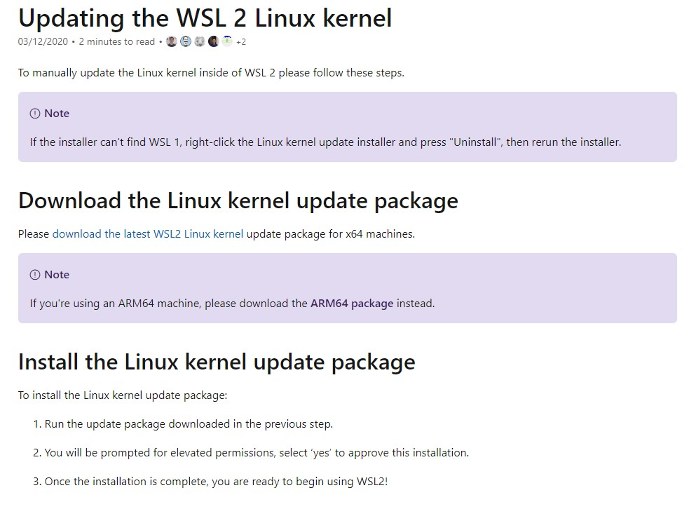

3. Tes Versi Docker

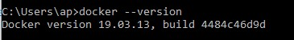

4. Tes Hasil Instalasi Docker

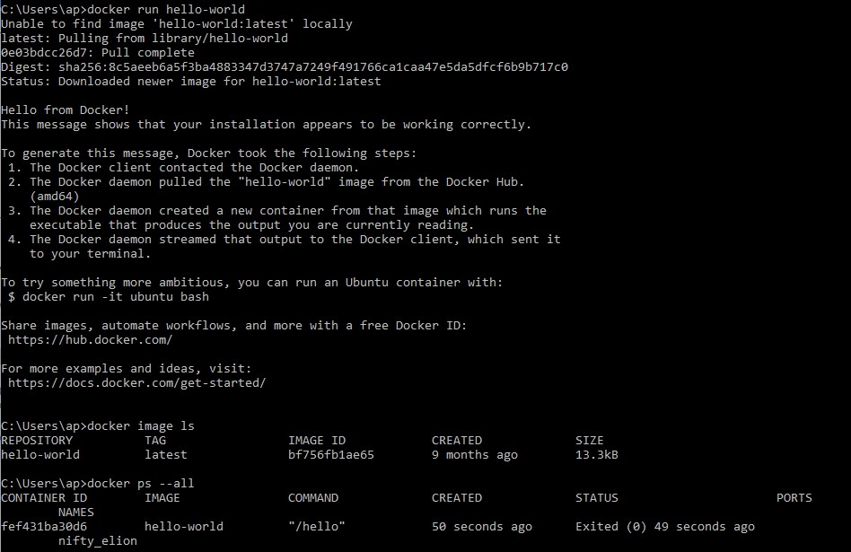

5. Unduh contoh proyek node-bulletin-board dengan Git

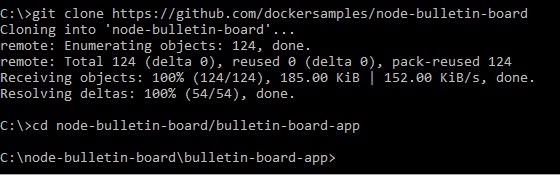

6. Membangun buletin board image

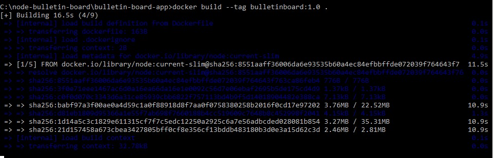

7. Menjalankan image sebagai container

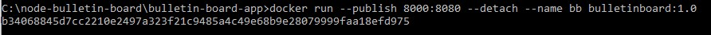

8. Lihat melalui browser dengan alamat localhost:8000

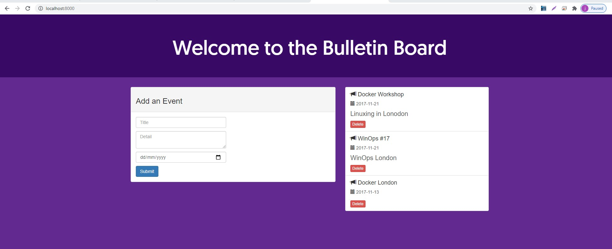

9. Hapus buletin board container

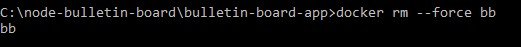

10. Sign Up Akun Docker Hub

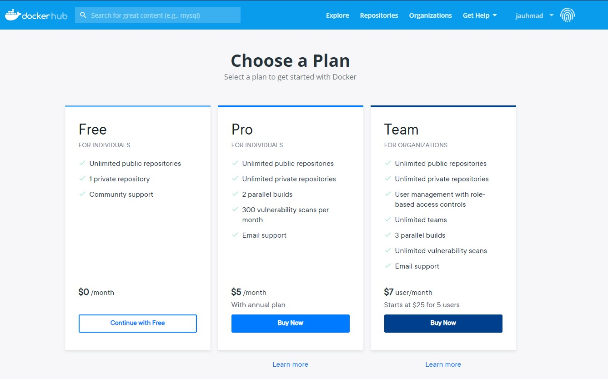

11. Set up akun Docker Hub untuk dihubungkan dengan Docker Desktop

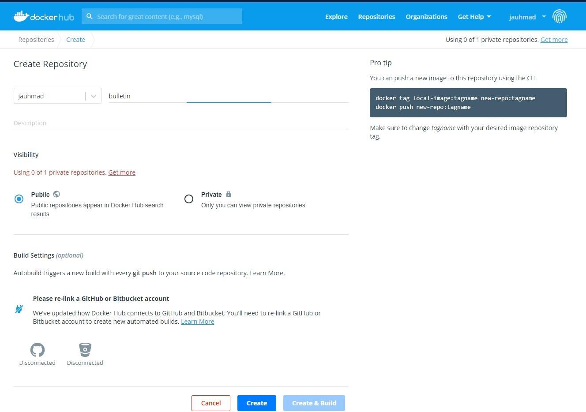

12. Share image yang ada di Docker Hub

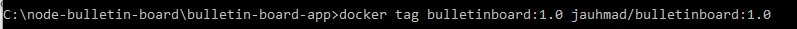

13. Push image ke Docker Hub

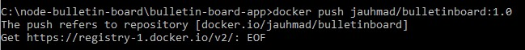

