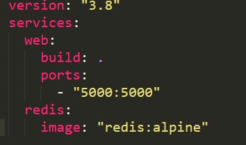

https://github.com/jauhmad/tekn-cloud-computing/blob/master/minggu-08/laporan%20praktikum.md
# Laporan Praktikum Teknologi Teknologi Cloud Computing - Minggu 08

## Materi

**Docker - Docker Compose - Docker Network - Docker Swarm**

## Disusun oleh:
* Nama : Jauhari Ahmad 
* No. Mhs : 205411167 

## Tujuan

1. Mahasiswa memahami keterkaitan antara docker, docker compose, docker network, dan docker swarm
2. Mahasiswa memahami dan mampu menggunakan docker compose.

## Pembahasan Hasil Praktikum

**Getting Started - Docker Compose**
1. Membuat direktori project

2. Membuat file app.py dan diletakkkan dalam direktori project

3. Membuat file requirements.txt

4. Membuat file Dockerfile

5. Membuat file docker-compose.yml

6. Menjalankan aplikasi yang ada dalam project

7. Akses http://localhost:5000 pada browser untuk memastikan aplikasi sudah berjalan

8. Refresh halaman, angka akan bertambah

9. Pindah ke terminal lain, menampilkan list image lokal

10. Hentikan aplikasi

**Diagram keterkaitan Docker image, Container, dockerd, docker client, docker compose, docker swarm**
