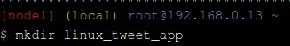
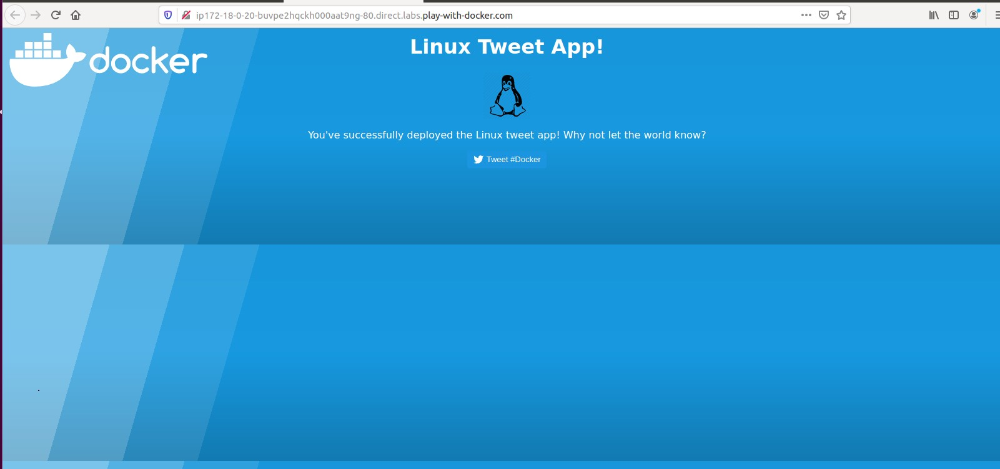

https://github.com/jauhmad/tekn-cloud-computing/blob/master/minggu-09/laporan%20praktikum.md
# Laporan Praktikum Teknologi Teknologi Cloud Computing - Minggu 09

## Materi

**Docker for Beginners - Linux**

## Disusun oleh:
* Nama : Jauhari Ahmad 
* No. Mhs : 205411167 

## Pembahasan Hasil Praktikum

**Docker for Beginners - Linux**
1. Membuat direktori linux_tweet_app

2. Git clone repository ke direktori linux_tweet_app

3. Jalankan beberapa container Docker sederhana. Memulai container baru. Output di bawah ini menunjukkan bahwa alpine: image terbaru tidak dapat ditemukan secara lokal. Ketika ini terjadi, Docker secara otomatis menariknya dari Docker Hub. Setelah gambar ditarik, nama host penampung ditampilkan (888e89a3b36b pada contoh di bawah).

4. Docker membuat kontainer tetap berjalan selama proses yang dimulai di dalam kontainer masih berjalan. Dalam hal ini proses nama host keluar segera setelah keluaran ditulis. Ini berarti wadahnya berhenti. Namun, Docker tidak menghapus sumber daya secara default, sehingga kontainer masih ada dalam status Keluar. Buat daftar semua wadah.

5. Jalankan container Docker dan akses shell nya

6. Menjalankan beberapa perintah. ls / akan membuat daftar isi dari root director di wadah, ps aux akan menunjukkan proses yang sedang berjalan di wadah, cat / etc / issue akan menunjukkan distro Linux mana yang menjalankan container

7. Ketik exit untuk keluar dari sesi shell. Ini akan menghentikan proses bash, menyebabkan penampung keluar.

8. Periksa versi VM

9. Jalankan container MySQL baru dengan perintah berikut.

10. Buat daftar container yang sedang berjalan

11. Anda dapat memeriksa apa yang terjadi di container Anda dengan menggunakan beberapa perintah Docker bawaan: log container docker dan container top docker

12. Mari kita lihat proses yang berjalan di dalam penampung.

13. Cantumkan versi MySQL menggunakan container docker exec.
docker container exec memungkinkan Anda menjalankan perintah di dalam container. Dalam contoh ini, kita akan menggunakan container docker exec untuk menjalankan baris perintah yang setara dengan mysql --user = root --password = $ MYSQL_ROOT_PASSWORD --version di dalam container MySQL kita.

14. Anda juga dapat menggunakan container exec docker untuk menghubungkan ke proses shell baru di dalam container yang sudah berjalan. Menjalankan perintah di bawah ini akan memberi Anda shell interaktif (sh) di dalam container MySQL Anda.

15. Pastikan Anda berada di direktori linux_tweet_app. Tampilkan konten Dockerfile.

16. echo nilai variabel kembali ke terminal untuk memastikannya disimpan dengan benar.

17. Gunakan perintah build docker image untuk membuat image Docker baru menggunakan instruksi di Dockerfile

18. Gunakan perintah docker container run untuk memulai container baru dari gambar yang Anda buat. Karena penampung ini akan menjalankan server web NGINX, kami akan menggunakan tanda --publish untuk memublikasikan port 80 di dalam penampung ke port 80 pada host. Ini akan memungkinkan lalu lintas yang masuk ke host Docker pada port 80 untuk diarahkan ke port 80 di kontainer. Format bendera --publish adalah host_port: container_port.

19. Cek website sudah berjalan

20. Setelah Anda mengakses situs web Anda, matikan dan hapuslah.

21. Mari mulai aplikasi web dan pasang direktori saat ini ke dalam penampung. Dalam contoh ini kita akan menggunakan tanda --mount untuk memasang direktori saat ini pada host ke / usr / share / nginx / html di dalam wadah. Pastikan untuk menjalankan perintah ini dari dalam direktori linux_tweet_app di host Docker Anda.

22. Cek website sudah berjalan

23. Salin index.html baru ke dalam penampung. Repo Git yang Anda tarik sebelumnya berisi beberapa versi berbeda dari file index.html. Anda dapat menjalankan perintah ls secara manual dari dalam direktori ~ / linux_tweet_app untuk melihat daftarnya. Pada langkah ini kita akan mengganti index.html dengan index-new.html.

24. Refresh halaman website. Tampilan sudah berubah

25. Hentikan dan hapus penampung yang sedang berjalan. Jalankan kembali versi saat ini tanpa bind mount.

26. Tampilan website kembali seperti semula

27. Hentikan dan hapus wadah saat ini

28. Buat gambar baru dan beri tag sebagai 2.0. Ingatlah bahwa Anda sebelumnya memodifikasi file index.html di sistem file lokal host Docker. Ini berarti bahwa menjalankan perintah build image buruh pelabuhan lain akan membangun image baru dengan index.html yang diperbarui. Pastikan untuk menyertakan titik (.) Di akhir perintah.

29. Mari kita lihat image di sistem.

30. Jalankan penampung baru dari versi baru gambar.

31. Refresh halaman website. Halaman web akan memiliki latar belakang oranye.Kami dapat menjalankan kedua versi secara berdampingan. Satu-satunya hal yang perlu kita waspadai adalah kita tidak dapat memiliki dua kontainer yang menggunakan port 80 pada host yang sama.Karena kami sudah menggunakan port 80 untuk penampung yang berjalan dari gambar versi 2.0, kami akan memulai penampung baru dan menerbitkannya di port 8080. Selain itu, kami perlu memberi penampung kami nama yang unik (old_linux_tweet_app)

32. Jalankan penampung baru lainnya, kali ini dari gambar versi lama. Perhatikan bahwa perintah ini memetakan container baru ke port 8080 pada host. Ini karena dua kontainer tidak dapat memetakan ke port yang sama pada satu host Docker.

33. Lihat versi lama situs web

34. Buat daftar gambar di host Docker Anda. sebelum Anda dapat mendorong gambar Anda, Anda harus masuk ke Docker Hub.

35. Push versi 1.0 aplikasi web Anda menggunakan push image docker.

36. Push versi 2.0 

37. Telusuri https://hub.docker.com/r/jauhmad/ dan melihat image Docker yang baru Anda push. Ini adalah repositori publik, jadi siapa pun dapat menarik gambar - Anda bahkan tidak memerlukan ID Docker untuk menarik gambar publik. Docker Hub juga mendukung repositori pribadi.

