https://github.com/jauhmad/tekn-cloud-computing/blob/master/minggu-10/laporan%20praktikum.md
# Laporan Praktikum Teknologi Teknologi Cloud Computing - Minggu 10

## Materi

**Docker Networking**

## Disusun oleh:
* Nama : Jauhari Ahmad 
* No. Mhs : 205411167 

## Pembahasan Hasil Praktikum

**Docker Networking Hands-on Lab**
1. Perintah Docker Network

Perintah utama untuk mengkonfigurasi dan mengelola jaringan kontainer

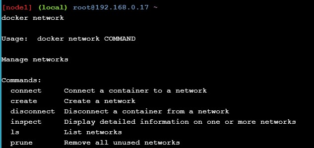

2. List networks

Perintah untuk melihat jaringan kontainer yang ada di host Docker saat ini.

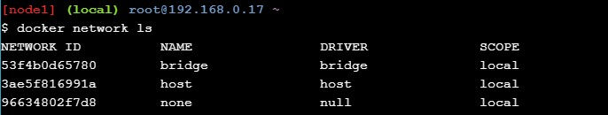

3. Inspect a network

Perintah untuk melihat detail konfigurasi jaringan. Rincian ini meliputi; nama, ID, driver, driver IPAM, info subnet, container yang terhubung, dan lainnya.

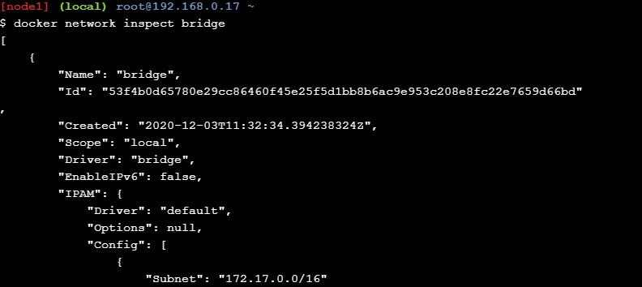

4. List network driver plugins

Perintah menunjukkan banyak informasi menarik tentang instalasi Docker.

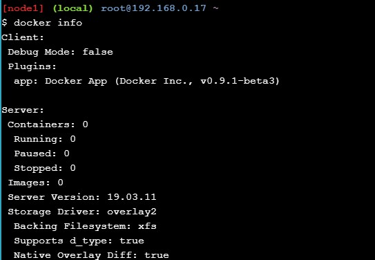

5. The Basics Networking

Untuk memverifikasi setiap instalasi Docker yang dilengkapi dengan jaringan pra-bangun yang disebut bridge

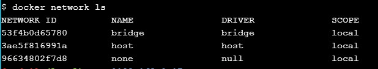

6. Install the brctl command and use it to list the Linux bridges on your Docker host. 

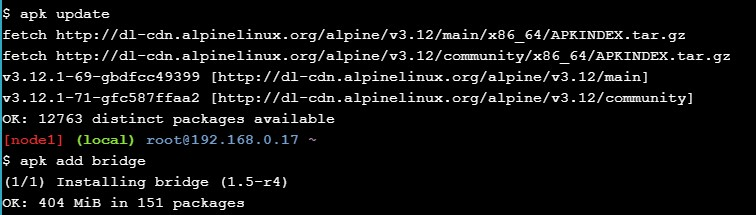

7. List the bridges on your Docker host

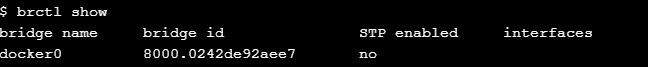

8. You can also use the ip a command to view details of the docker0 bridge.

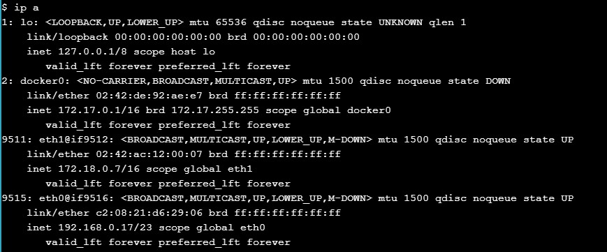

9. Create a new container

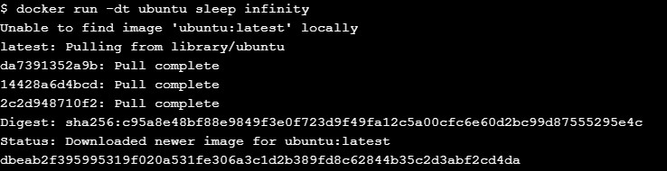

10. You can verify our example container is up

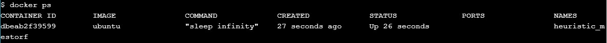

11. Run the brctl show command again.

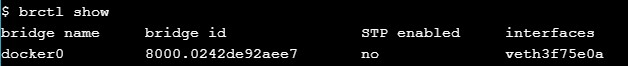

12. You can inspect the bridge network again

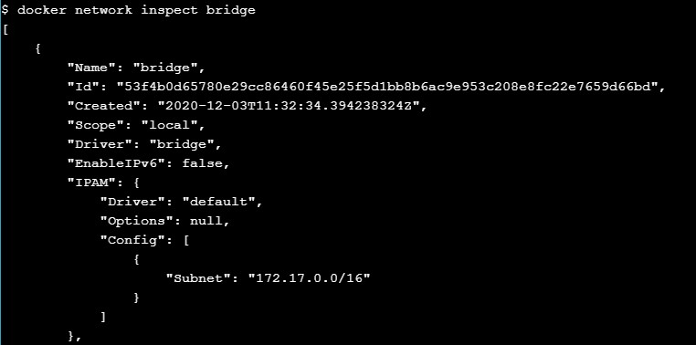

13. Ping the IP address of the container from the shell prompt of your Docker host 

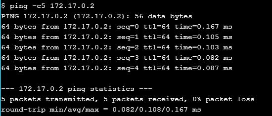

14. Get the ID of the container started in the previous step

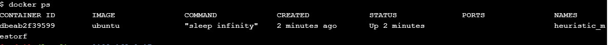

15. Next, lets run a shell inside that ubuntu container

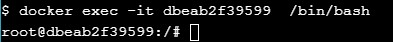

16. Next, we need to install the ping program.

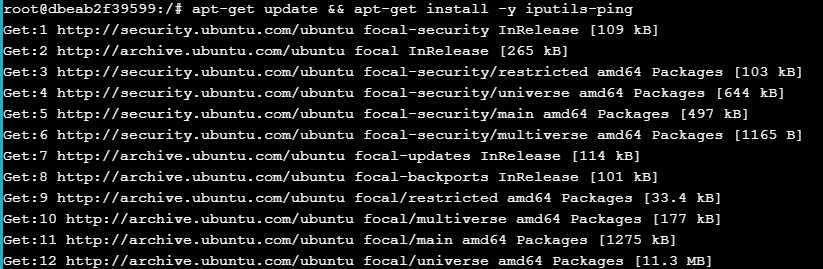

17. Ping www.github.com

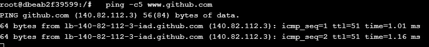

18. Finally, lets disconnect our shell from the container

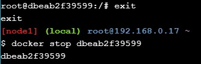

19. Start a new container based off the official NGINX image

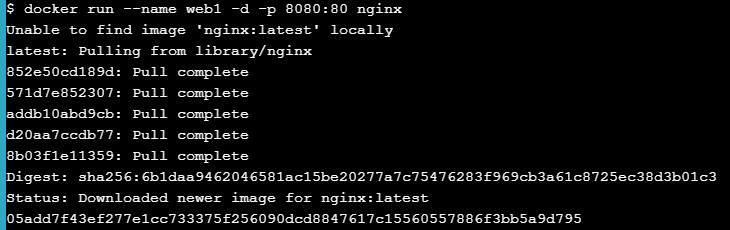

20. Review the container status and port mappings

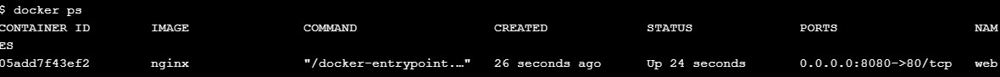

21. Connect from your Docker host 

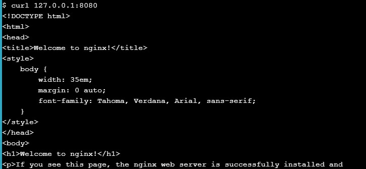

22. Initialize a new Swarm, join a single worker node, and verify the operations worked.

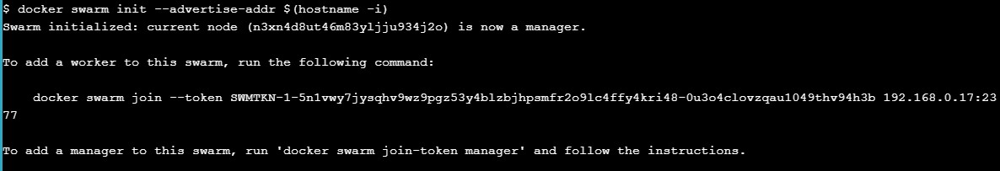

23. In the first terminal copy the entire docker swarm join ... command that is displayed as part of the output from your terminal output. Then, paste the copied command into the second terminal.

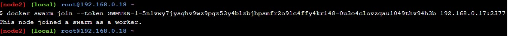

24. Verify that both nodes are part of the Swarm

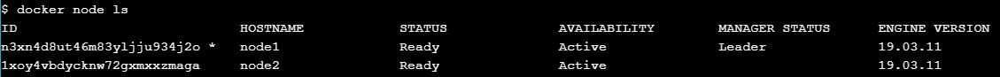

25. Create a new overlay network called “overnet” 

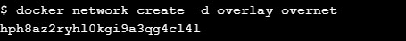

26. Verify the network was created successfully.

27. Run the same docker network ls command from the second terminal.

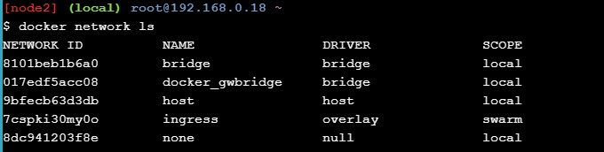

28.  View more detailed information about the “overnet” network. You will need to run this command from the first terminal.

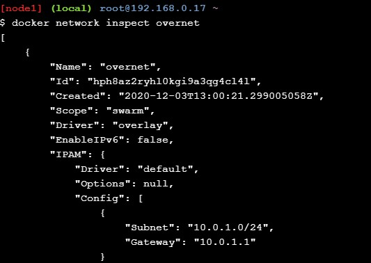

29. Create a new service called myservice on the overnet network with two tasks/replicas.

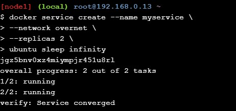

30. Verify that the service is created and both replicas

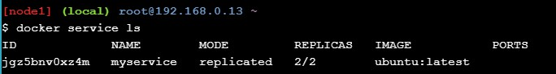

31. Verify that a single task (replica) is running on each of the two nodes in the Swarm 

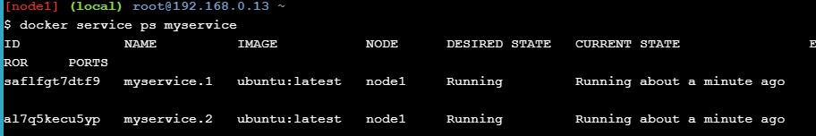

32. Now that the second node is running a task on the “overnet” network it will be able to see the “overnet” network. Lets run docker network ls from the second terminal to verify this.

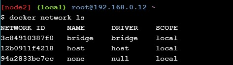

33. Get more detailed information about the “overnet” network and obtain the IP address of the task running on the second terminal.

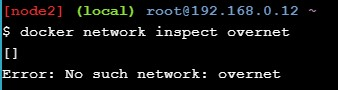

34. Execute the following commands from the first terminal. Notice that the IP address listed for the service task (container) running is different to the IP address for the service task running on the second node. Note also that they are on the same “overnet” network.

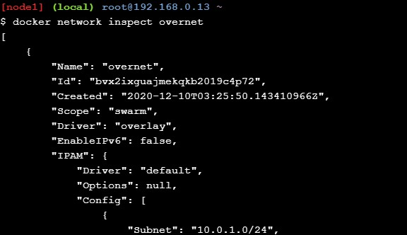

35. Get the ID of the service task so that you can log in to it in the next step.

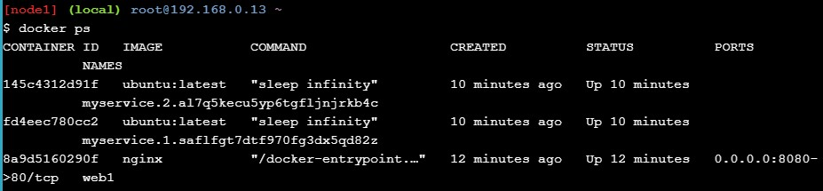

36. Log on to the service task. Be sure to use the container ID from your environment as it will be different from the example shown below. We can do this.

37. Install the ping command and ping the service task running on the second node where it had a IP address of 10.0.0.3 from the docker network inspect overnet command.

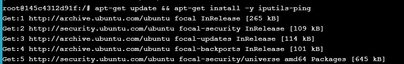

38. Ping 10.0.0.3

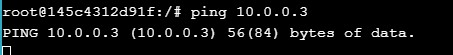

39. Test service discovery.

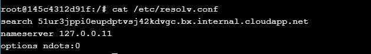

40. Try and ping the “myservice” name from within the container by running ping -c5 myservice.

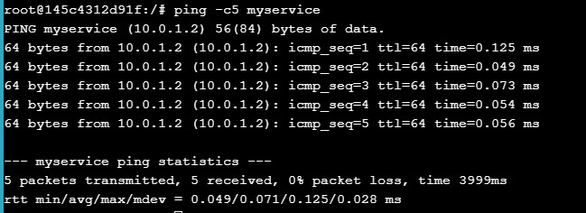

41. Type the exit command to leave the exec container session and return to the shell prompt of your Docker host.

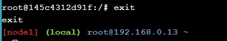

42. Inspect the configuration of the “myservice” service

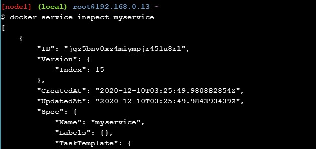

43. Remove the service called myservice.

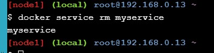

44. Get a list of running containers.

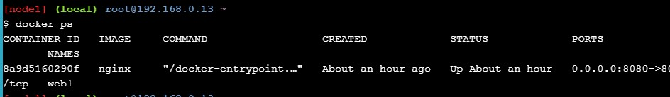

45. Gunakan docker kill <CONTAINER ID ...> untuk menghentikan contniner ubunut dan nginx
  

46. Hilangkan node1 dari Swarm

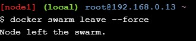

47. Hilangkan node2 dari Swarm

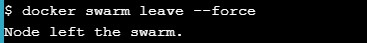

47. Selesai

