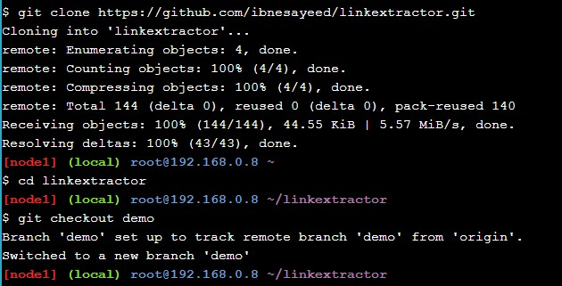
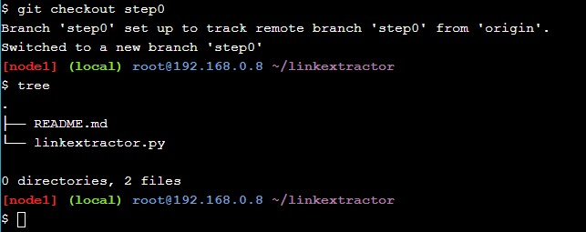
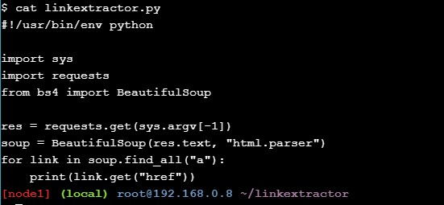
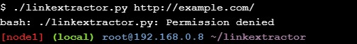
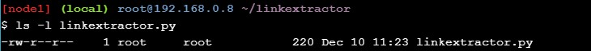
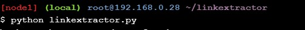

https://github.com/jauhmad/tekn-cloud-computing/blob/master/minggu-11/laporan%20praktikum.md
# Laporan Praktikum Teknologi Teknologi Cloud Computing - Minggu 11

## Materi

**Application Containerization and Microservice Orchestration**

## Disusun oleh:
* Nama : Jauhari Ahmad 
* No. Mhs : 205411167 

## Pembahasan Hasil Praktikum

**Stage Setup**
Let’s get started by first cloning the demo code repository, changing the working directory, and checking the demo branch out.

**Step 0: Basic Link Extractor Script**
Checkout the step0 branch and list files in it.

The linkextractor.py file is the interesting one here, so let’s look at its contents:

However, this seemingly simple script might not be the easiest one to run on a machine that does not meet its requirements. The README.md file suggests how to run it, so let’s give it a try:

When we tried to execute it as a script, we got the Permission denied error. Let’s check the current permissions on this file:

This current permission -rw-r--r-- indicates that the script is not set to be executable. We can either change it by running chmod a+x linkextractor.py or run it as a Python program instead of a self-executing script as illustrated below:

