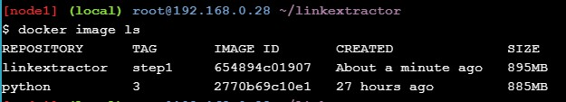
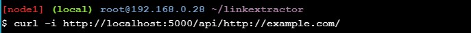

https://github.com/jauhmad/tekn-cloud-computing/blob/master/minggu-11/laporan%20praktikum.md
# Laporan Praktikum Teknologi Teknologi Cloud Computing - Minggu 11

## Materi

**Application Containerization and Microservice Orchestration**

## Disusun oleh:
* Nama : Jauhari Ahmad 
* No. Mhs : 205411167 

## Pembahasan Hasil Praktikum

**Stage Setup**

Let’s get started by first cloning the demo code repository, changing the working directory, and checking the demo branch out.

**Step 0: Basic Link Extractor Script**

Checkout the step0 branch and list files in it.

The linkextractor.py file is the interesting one here, so let’s look at its contents:

However, this seemingly simple script might not be the easiest one to run on a machine that does not meet its requirements. The README.md file suggests how to run it, so let’s give it a try:

When we tried to execute it as a script, we got the Permission denied error. Let’s check the current permissions on this file:

This current permission -rw-r--r-- indicates that the script is not set to be executable. We can either change it by running chmod a+x linkextractor.py or run it as a Python program instead of a self-executing script as illustrated below:

**Step 1: Containerized Link Extractor Script**

Checkout the step1 branch and list files in it.

We have added one new file (i.e., Dockerfile) in this step. Let’s look into its contents:

So far, we have just described how we want our Docker image to be like, but didn’t really build one. So let’s do just that:

We have created a Docker image named linkextractor:step1 based on the Dockerfile illustrated above. If the build was successful, we should be able to see it in the list of image:

This image should have all the necessary ingredients packaged in it to run the script anywhere on a machine that supports Docker. Now, let’s run a one-off container with this image and extract links from some live web pages:

Let’s try it on a web page with more links in it:

**Step 2: Link Extractor Module with Full URI and Anchor Text**

Checkout the step2 branch and list files in it.

Let’s have a look at the updated script:

Now, let’s build a new image and see these changes in effect:

We have used a new tag linkextractor:step2 for this image so that we don’t overwrite the image from the step0 to illustrate that they can co-exist and containers can be run using either of these images.

Running a one-off container using the linkextractor:step2 image should now yield an improved output:

Running a container using the previous image linkextractor:step1 should still result in the old output:

**Step 3: Link Extractor API Service**

Checkout the step3 branch and list files in it.

Let’s first look at the Dockerfile for changes:

The linkextractor.py module remains unchanged in this step, so let’s look into the newly added main.py file:

It’s time to build a new image with these changes in place:

We are also assigning a name (--name=linkextractor) to the container to make it easier to see logs and kill or remove the container.

If things go well, we should be able to see the container being listed in Up condition:

We can now make an HTTP request in the form /api/<url> to talk to this server and fetch the response containing extracted links:
  
  

Since the container is running in detached mode, so we can’t see what’s happening inside, but we can see logs using the name linkextractor we assigned to our container:

  

We can see the messages logged when the server came up, and an entry of the request log when we ran the curl command. Now we can kill and remove this container:

  

**Step 4: Link Extractor API and Web Front End Services**

Checkout the step4 branch and list files in it.

  

So let’s look at the docker-compose.yml file we have:

  

Now, let’s have a look at the user-facing www/index.php file:

 

Let’s bring these services up in detached mode using docker-compose utility:

 

Checking for the list of running containers confirms that the two services are indeed running:

 

We should now be able to talk to the API service as before:

 

Now, let’s modify the www/index.php file to replace all occurrences of Link Extractor with Super Link Extractor:

 

Let’s revert these changes now to clean the Git tracking:

 

Before we move on to the next step we need to shut these services down, but Docker Compose can help us take care of it very easily:

 

**Step 5: Redis Service for Caching**

Checkout the step5 branch and list files in it.

 

Let’s first inspect the newly added Dockerfile under the ./www folder:

 

Next, we will look at the API server’s api/main.py file where we are utilizing the Redis cache:

 

Now, let’s look into the updated docker-compose.yml file:

 

Let’s boot these services up:

 

To check whether or not the Redis service is being utilized, we can use docker-compose exec followed by the redis service name and the Redis CLI’s monitor command:

 

Now that we are not mounting the /www folder inside the container, local changes should not reflect in the running service:

 

Verify that the changes made locally do not reflect in the running service by reloading the web interface and then revert changes:

 

Now, shut these services down and get ready for the next step:

 

**Step 6: Swap Python API Service with Ruby**

Checkout the step6 branch and list files in it.

 

Let’s have a quick walk through the changed files:

 

In a microservice architecture application swapping components with an equivalent one is easy as long as the expectations of consumers of the component are maintained.

 

Above Dockerfile is written for the Ruby script and it is pretty much self-explanatory.

 

With these in place, let’s boot our service stack:

 

We should now be able to access the API (using the updated port number):

 

We can shut the stack down now:

 

Since we have persisted logs, they should still be available after the services are gone:

 

## Kesimpulan

Tutorial ini dimulai dengan skrip Python sederhana yang mengambil tautan dari URL laman web pemberian. Ditunjukkan berbagai kesulitan dalam menjalankan skrip. Kemudian mengilustrasikan betapa mudahnya dijalankan dan portabel skrip menjadi begitu dalam container. Di langkah selanjutnya, mengembangkan skrip menjadi tumpukan aplikasi multi-layanan. Dalam prosesnya, mengeksplorasi berbagai konsep arsitektur layanan mikro dan bagaimana alat Docker dapat membantu dalam mengatur tumpukan multi-layanan. Kemudian mendemonstrasikan kemudahan pertukaran komponen layanan mikro dan persistensi data.
