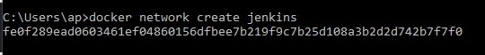
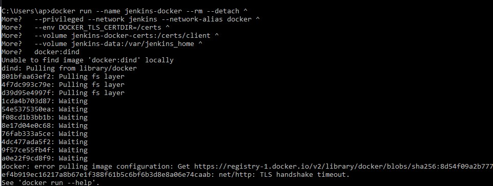
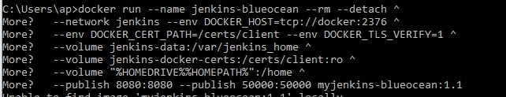

https://github.com/jauhmad/tekn-cloud-computing/blob/master/minggu-13/laporan%20praktikum.md
# Laporan Praktikum Teknologi Teknologi Cloud Computing - Minggu 13

## Materi

**Git dan Automation - CI/CD (Continuous Integration/Delivery**

## Disusun oleh:
* Nama : Jauhari Ahmad 
* No. Mhs : 205411167 

## Dasar Teori

* https://git-scm.com/doc
* https://en.wikipedia.org/wiki/CI/CD

## Pembahasan Hasil Praktikum

**Build a Java app with Maven**
# Run Jenkins in Docker On Windows

1. Open up a command prompt window and similar to the macOS and Linux instructions above do the following:

2. Create a bridge network in Docker

3. Run a docker:dind Docker image

4. Build a customised official Jenkins Docker image using above Dockerfile and docker build command.

5. Run your own myjenkins-blueocean:1.1 image as a container in Docker using the following docker run command:

# Proceed to the Setup wizard

1. Unlocking Jenkins

Browse to http://localhost:8080

Display the Jenkins console log with the command:

From your terminal/command prompt window again, copy the automatically-generated alphanumeric password (between the 2 sets of asterisks).

